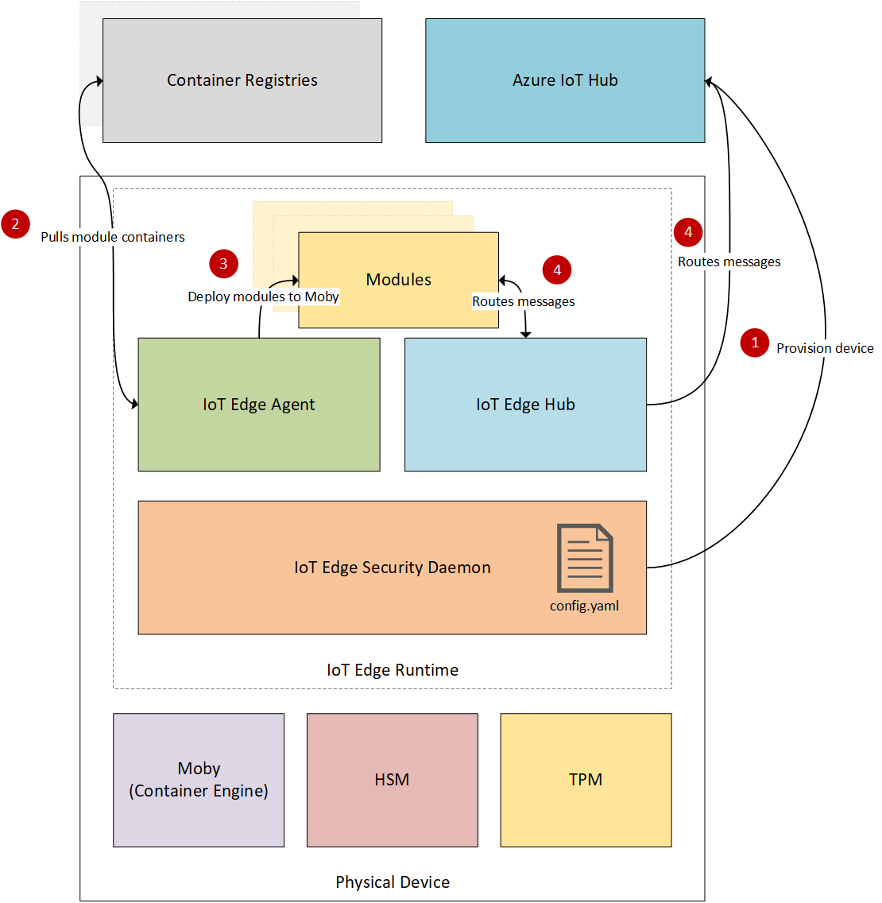
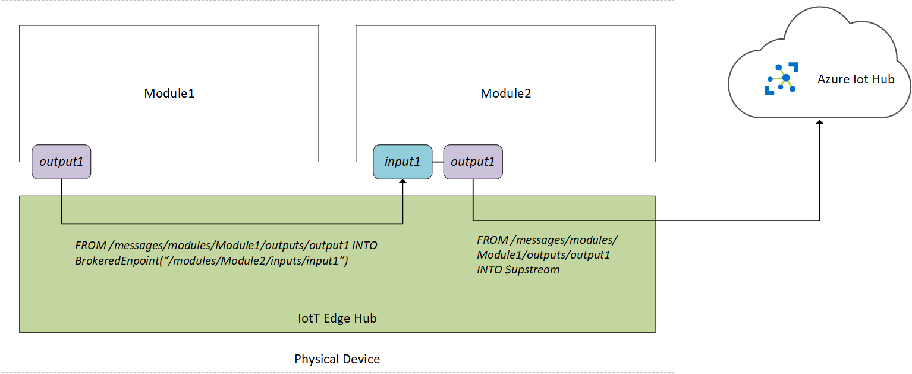

# Azure IoT Edge
Azure IoT Edge provides a structured and fully managed IoT platform built around Azure IoT Hubs, created to address the following IoT challenges:

* Edge Intelligence (including Machine Learning and AI)
* Over-the-air (OTA) solution deployments and upgrades at scale
* Secured device provisioning at scale
* Structured intra-device messaging
* Device and module health tracking and reporting
* Secure and reliable messaging between devices and cloud at scale
* Durable messaging for occasionally connected devices

IoT Edge solutions are constructed through a collection of one or more containerized **modules** working together within an IoT Edge solution.  These modules can be custom coded or pulled from the Azure Marketplace for common scenarios (like Stream Analytics, Machine Learning, etc.)

## Architecture
IoT Edge solutions are enabled via the IoT Edge Runtime.  The following image outlines the high level IoT Edge Runtime architecture.



### Moby
IoT Edge relies on an OCI-compliant container engine for solution orchestration and deployments.  Moby is the officially supported container engine for IoT edge ([Moby project](https://mobyproject.org/)), and must be deployed to each device.

### IoT Edge Runtime
The *IoT Edge Runtime* consists of three primary components:  
* IoT Edge Security Daemon
* IoT Edge Agent
* IoT Edge Hub

Together, these services provide the necessary communication and module management plumbing for building IoT Edge solutions.  The IoT Edge Runtime must be installed on each device.

> *NOTE*, installation instructions for Raspberry PI can be found at [https://docs.microsoft.com/en-us/azure/iot-edge/how-to-install-iot-edge-linux](https://docs.microsoft.com/en-us/azure/iot-edge/how-to-install-iot-edge-linux)


#### IoT Edge Security Daemon
The *IoT Edge Runtime* starts with the *IoT Edge Security Daemon*.  The *IoT Edge Security Daemon* is primarily responsible for the following:
* Bootstrapping the IoT Edge runtime at startup
* Driving the initial device provisioning within IoT Hub
* Brokered communications between the *IoT Edge Runtime*, the container engine, and hardware-based cryptograpy services such as Hardware Security Modules (HSM) or Trusted Platform Modules (TPM)

#### IoT Edge Agent
The *IoT Edge Agent* is responsible for module management, including the following:
* Install and update modules and solutions onto a device
* Report module and device health
* Ensure modules are always running

#### IoT Edge Hub
The *IoT Edge Hub* facilitates intra-device messaging (between modules) as well as messaging between the device and Azure IoT Hub.

#### Modules
Containerized logic (either custom or from the Azure IoT marketplace).  Multiple modules can be run on a single device, and communicate with each other through known **inputs** and **outputs**.  A module's job might be to read from a sensor, or apply machine learning to device telemetry data.

#### Deployment Manifest
JSON document containing a list of module twins and their desired properties.  *Deployment manifests* define everything required for versioned solution deployments.  Below is an example:

```json
{
  "modulesContent": {
    "$edgeAgent": {
      "properties.desired": {
        "schemaVersion": "1.0",
        "runtime": {
          "type": "docker",
          "settings": {
            "minDockerVersion": "v1.25",
            "loggingOptions": "",
            "registryCredentials": {
              "MyRegistry": {
                "username": "myacr",
                "password": "<password>",
                "address": "myacr.azurecr.io"
              }
            }
          }
        },
        "systemModules": {
          "edgeAgent": {
            "type": "docker",
            "settings": {
              "image": "mcr.microsoft.com/azureiotedge-agent:1.0",
              "createOptions": ""
            }
          },
          "edgeHub": {
            "type": "docker",
            "status": "running",
            "restartPolicy": "always",
            "settings": {
              "image": "mcr.microsoft.com/azureiotedge-hub:1.0",
              "createOptions": ""
            }
          }
        },
        "modules": {
          "SimulatedTemperatureSensor": {
            "version": "1.0",
            "type": "docker",
            "status": "running",
            "restartPolicy": "always",
            "settings": {
              "image": "mcr.microsoft.com/azureiotedge-simulated-temperature-sensor:1.0",
              "createOptions": "{}"
            }
          },
          "FilterSensorData": {
            "version": "1.0",
            "type": "docker",
            "status": "running",
            "restartPolicy": "always",
            "settings": {
              "image": "myacr.azurecr.io/FilterSensorData:latest",
              "createOptions": "{}"
            }
          }
        }
      }
    },
    "$edgeHub": {
      "properties.desired": {
        "schemaVersion": "1.0",
        "routes": {
          "sensorToFilter": "FROM /messages/modules/SimulatedTemperatureSensor/outputs/temperatureOutput INTO BrokeredEndpoint(\"/modules/FilterSensorData/inputs/input1\")",
          "filterToIoTHub": "FROM /messages/modules/FilterSensorData/outputs/output1 INTO $upstream"
        },
        "storeAndForwardConfiguration": {
          "timeToLiveSecs": 10
        }
      }
    }
  }
}

```

#### Message Routing
*IoT Edge Hub* provides managed message routing between device modules as well as between modules and the cloud.  Messaging communication is defined through routes (within $edgeHub's module twin).  Each route defines **outputs** (message publisher) and **inputs** (message subscriber).



# Demo: Create and Deploy IoT Edge Solution (Single Device)

This demo will focus on setting up and deploying a basic IoT Edge solution to a single device.  During this demo, we will:

1. Review the Azure IoT Tools extension in VSCode
2. Create a new logical IoT Edge device
3. Provision an IoT Edge device
4. Create and deploy an IoT Edge Solution to the device


> **NOTE** while this demo uses VSCode, these steps can also be achieved in the Azure Portal or be automated via the Azure CLI


## Prerequisites

1. Visual Studio Code
   1. Azure IoT Tools extension
2. Run the initialize.sh script
   1. Ensure the demo-edge-device-1 vm is started
   2. Ensure the Azure IoT hub has been deployed

## Create Logic IoT Edge Device within IoT Hub
1. In VSCode, open Explorer View
2. At the bottom, expand the **Azure IoT Hub** section
3. Choose **Select IoT Hub** from menu
   1. Select your Subscription
   2. Select your IoT Hub
4. Click **...** and select **Create IoT Edge Device**
5. Provide your device with a name **demo-edge-device-1** (name doesn't matter)
   1. Note the **Output** window displays device information (including connectionState and connectionString to be used)

## Provision Device
Before we can deploy an IoT Edge Solution to a device, we need to deploy the following components to our IoT Edge Device (detailed device-specific instructions can be found at [https://docs.microsoft.com/en-us/azure/iot-edge/how-to-install-iot-edge-linux](https://docs.microsoft.com/en-us/azure/iot-edge/how-to-install-iot-edge-linux)):

1. OCI-compatible container runtime (Moby Recommended)
2. Azure IoT Edge Security Daemon
3. Configure the Azure IoT Edge Security Daemon via */etc/iotedge/config.yaml*

### Provision Device
1. ssh into the *demo-edge-device-1* (ssh azureuser@ipaddress)
2. Run command *cd /etc/iotedge*
3. Run command *sudo vim config.yaml
   1. Note, there is configedge.sh script that you can run to do this, but let's look at the yaml file itself
   2. Enter insert mode command *i*
   3. Click demo-edge-device-1 device in VSCode and select **Copy Device Connection String**
   4. Copy value into config.yaml's **device_connection_string** value
   5. Save and quit vim (*ESC*, *:x!*)
4. Run command *sudo systemctl restart iotedge*
5. Check the status with the following commands:
   1. *sudo systemctl status iotedge*
   2. *sudo iotedge list* (note nothing is running running)
   3. if you come across problems, view the logs with *journalctl --no-pager -u iotedge*


## Create and Deploy IoT Edge Solution
Now that we have a provisioned IoT Edge device, let's create a deployment manifest, which will define the modules to be deployed to the device

### Steps
1. In VSCode, open the Command Palette (CTR + SHIFT + P) and select **Azure IoT Edge: New IoT Edge Solution**
2. Browse to the appropriate folder and provide a name for the solution **SimulatedSolution**
3. Select **Module from Azure Marketplace**
4. Take a moment to review the different options, including Cognitive Services, EventGrid, Stream Analytics, etc.
5. Select **Simulated Temperature Sensor**
6. Review the *deployment.template.json* file.  Notice the system module configuration ($edgeAgent and $edgeIoT and routes)
7. Build IoT Edge solution
   1. Notice the platform architecture in the VSCode footer.  Make sure this is set to **amd64**
   2. Select *deployment.template.json* and click **Build IoT Edge Solution**
   3. Notice the deployment manifests witin the config directory
8. Open Command Palette and select **Azure IoT Edge: Create Deployment for Single Device**
   1. Select the logic device to be deployed to
   2. Select config/deployment.amd64.json
   3. On the device, run *sudo iotedge list* and note the $edgeAgent, $edgeHub and SimulatedTemperatureSensor are running
   4. In VSCode, select the iot-hub and select *Start Monitoring Build-In Event Endpoint*
      1. you should see events streaming to the Output window


