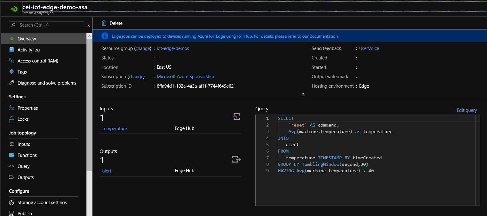

# Overview
In the previous demo, we learned some of the basics of Azure IoT Edge, provisioned a new device, and deployed a simple solution to the device.  During this demo, we're going to build upon that solution with the following objectives:

1. Add a new Stream Analytics Job module for querying realtime temperature data streaming from the Simulated Temperature Sensor module
2. Create a custom module which adds **reported properties** for high temperature averages
3. Run and debug the IoT Edge solution
4. Deploy the solution updates to the device

## Prerequisites

1. Visual Studio Code
   1. Azure IoT Tools extension
   2. C# extensions
   3. Docker extensions
2. .NET Core 3.1 installed
3. Ensure **Docker for Windows** is installed on the development machine
4. Ensure Python 3.7 is installed with PIP on the development machine
   1. NOTE: at the time of writing this, *iotedgehubdev* is not supported on Python 3.8
5. Ensure **iotedgehubdev** is installed on the development machine
   1. *pip install --upgrade iotedgehubdev*
6. Run the initialize.sh script (if not already run)
   1. Ensure the demo-edge-device-1 vm is started
   2. Ensure the Azure IoT hub has been deployed
   3. Ensure the Azure Container Registry has been deployed
7. Make sure Demo 1 has been completed
8. Create an Edge Stream Analytics Job within Azure

# Demo 1: Add Stream Analytics Module
In this demo, we'll add a Stream Analytics module, which looks for higher than normal temperature averages from the SimulatedTemperatureSensor module, and resets the module when the temperature goes above 40 degrees for a period of time.

## Azure Stream Analytics
Azure Stream Analytics provides the ability to query and analyze streaming data realtime using a SQL syntax.  While the cloud-based Stream Analytics can process millions of events per second across all your devices within the cloud, Stream Analytics Edge allows you to perform device-scoped queries on the individual devices themselves, providing the following benefits:
1. Reduce round-trips to cloud
2. Faster response to events 
3. Query device data in disconnected scenarios

Azure Analytics Job configurations are authored within Azure and are synced to devices upon deployment.  Here is the configuration we'll use for this demo:



### Inputs
Stream analytics Jobs require an input source to query.  For IoT Edge, the Edge Hub will be our query source.

### Query
The below SQL Query looks for the average temperatures greater than 40 degrees over a 30 second period.  The query reads from the *temperature* **input**
and writes the results to the *alert* **output**.  These *inputs* and *outputs* map to the associated module's *inputs* and *outputs*.

```sql
SELECT  
    'reset' AS command,
    Avg(machine.temperature) as temperature
INTO
   alert
FROM
   temperature TIMESTAMP BY timeCreated
GROUP BY TumblingWindow(second,30)
HAVING Avg(machine.temperature) > 40
```

### Outputs
Outputs messages to the **alert** output.

### Add Stream Analytics Module
1. Right-click the *modules* directory and select *Add IoT Edge Module*
2. Select *Azure Stream Analytics*
3. Enter *StreamAnalytics* for the Module Name
4. Select *cei-iot-edge-demo-asa* for the Stream Analytics Job
5. Add the following route between the SimulatedTemperatureSensor and StreamAnalytics modules (add to deployment.template and deployment.debug.template):
```json
"SimulatedTemperatureSensorToStreamAnalytics": "FROM /messages/modules/SimulatedTemperatureSensor/* INTO BrokeredEndpoint(\"/modules/StreamAnalytics/inputs/temperature\")",
```
6. Add the following route between the StreamAnalytics module and the SimulatedTemperatureSensor module:
```json
"StreamAnalyticsToReset": "FROM /messages/modules/StreamAnalytics/* INTO BrokeredEndpoint(\"/modules/SimulatedTemperatureSensor/inputs/control\")",
```

You should now have the following routes:

```json
"SimulatedTemperatureSensorToIoTHub": "FROM /messages/modules/SimulatedTemperatureSensor/* INTO $upstream",
"StreamAnalyticsToIoTHub": "FROM /messages/modules/StreamAnalytics/outputs/* INTO $upstream",
"SimulatedTemperatureSensorToStreamAnalytics": "FROM /messages/modules/SimulatedTemperatureSensor/* INTO BrokeredEndpoint(\"/modules/StreamAnalytics/inputs/temperature\")",
"StreamAnalyticsToReset": "FROM /messages/modules/StreamAnalytics/* INTO BrokeredEndpoint(\"/modules/SimulatedTemperatureSensor/inputs/control\")",
```
7. Save all changes
8. Right-click *deployment.debug.template.json* and select *Build and Run IoT Edge Solution in Simulator*
   
# Demo 2: Add Custom Module
In this demo, we'll add a custom C# module responsible for reporting back high temperatures via reported properties to the module twin.

1. Right-click the *modules* directory and select *Add IoT Edge Module*
2. Select *C# Module*
3. Enter *ResetReporter* for the Module Name
4. Set the container registry to *ceiiotdemo.azurecr.io/resetreporter*
5. Add the NewtonSoft package
```
cd modules/resetreporter
dotnet add package Newtonsoft.Json
```
6. Replace Program.cs with the following code:
```c#
namespace ResetReporter
{
    using System;
    using System.IO;
    using System.Runtime.InteropServices;
    using System.Runtime.Loader;
    using System.Security.Cryptography.X509Certificates;
    using System.Text;
    using System.Threading;
    using System.Threading.Tasks;
    using Microsoft.Azure.Devices.Client;
    using Microsoft.Azure.Devices.Client.Transport.Mqtt;
    using Newtonsoft.Json;
    using Newtonsoft.Json.Linq;

    class Program
    {
        static int counter;

        static void Main(string[] args)
        {
            Init().Wait();

            // Wait until the app unloads or is cancelled
            var cts = new CancellationTokenSource();
            AssemblyLoadContext.Default.Unloading += (ctx) => cts.Cancel();
            Console.CancelKeyPress += (sender, cpe) => cts.Cancel();
            WhenCancelled(cts.Token).Wait();
        }

        /// <summary>
        /// Handles cleanup operations when app is cancelled or unloads
        /// </summary>
        public static Task WhenCancelled(CancellationToken cancellationToken)
        {
            var tcs = new TaskCompletionSource<bool>();
            cancellationToken.Register(s => ((TaskCompletionSource<bool>)s).SetResult(true), tcs);
            return tcs.Task;
        }

        /// <summary>
        /// Initializes the ModuleClient and sets up the callback to receive
        /// messages containing temperature information
        /// </summary>
        static async Task Init()
        {
            MqttTransportSettings mqttSetting = new MqttTransportSettings(TransportType.Mqtt_Tcp_Only);
            ITransportSettings[] settings = { mqttSetting };

            // Open a connection to the Edge runtime
            ModuleClient ioTHubModuleClient = await ModuleClient.CreateFromEnvironmentAsync(settings);
            await ioTHubModuleClient.OpenAsync();
            Console.WriteLine("IoT Hub module client initialized.");

            // reset reported properties
            var reportedProperties = new Microsoft.Azure.Devices.Shared.TwinCollection();
            reportedProperties["highTemperature"] = (float) 0;
            reportedProperties["highTemperatureDate"] = string.Empty;
            await ioTHubModuleClient.UpdateReportedPropertiesAsync(reportedProperties);

            Console.WriteLine("Reset Reported Properties");

            // Register callback to be called when a message is received by the module
            await ioTHubModuleClient.SetInputMessageHandlerAsync("reporter", PipeMessage, ioTHubModuleClient);
        }

        /// <summary>
        /// This method is called whenever the module is sent a message from the EdgeHub. 
        /// It just pipe the messages without any change.
        /// It prints all the incoming messages.
        /// </summary>
        static async Task<MessageResponse> PipeMessage(Message message, object userContext)
        {
            int counterValue = Interlocked.Increment(ref counter);

            var moduleClient = userContext as ModuleClient;
            if (moduleClient == null)
            {
                throw new InvalidOperationException("UserContext doesn't contain " + "expected values");
            }

            byte[] messageBytes = message.GetBytes();
            string messageString = Encoding.UTF8.GetString(messageBytes);

            // update reported properties
            var reportedMessage = JObject.Parse(messageString);
            var reportedProperties = new Microsoft.Azure.Devices.Shared.TwinCollection();
            var highTemperature = (float) reportedMessage["temperature"];
            reportedProperties["highTemperature"] = highTemperature;
            reportedProperties["highTemperatureDate"] = DateTime.Now.ToShortTimeString();
            
            // report the high temperature back to the module twin
            await moduleClient.UpdateReportedPropertiesAsync(reportedProperties);

            Console.WriteLine("Updated Reported Properties");

            // send message to output (not required)
            var outputString = JsonConvert.SerializeObject(
                new { 
                    message="high temperature alert reported!",
                    temperature=highTemperature});
            
            var outputBytes = Encoding.UTF8.GetBytes(outputString);

            using (var pipeMessage = new Message(outputBytes))
            {
                await moduleClient.SendEventAsync("output1", pipeMessage);
                Console.WriteLine("Sent output message");
            }

            return MessageResponse.Completed;
        }
    }
}
```
## .NET 3.1
IoT Edge Tools templatize the solution against .NET Core 2.1.  Since we are targeting .NET Core 3.1, we have a number of changes to make.

### SensorSummaryModule.csproj
Replace
```xml
<TargetFramework>netcoreapp2.1</TargetFramework>
```
With
```xml
<TargetFramework>netcoreapp3.1</TargetFramework>
```

### .vsCode/launch.json
Need to repoint the debugger to target .NET Core 3.1 builds.

Replace
```json
"program": "${workspaceRoot}/modules/ResetReporter/bin/Debug/netcoreapp2.1/ResetReporter.dll",
```

With
```json
"program": "${workspaceRoot}/modules/ResetReporter/bin/Debug/netcoreapp3.1/ResetReporter.dll",
```

### Dockerfile.amd64
The default Dockerfiles are referencing .NET Core 2.1 build and publish docker containers.  We need to re-point these to the appropriate .NET Core 3.1 versions.  You can find environment-specific tagged versions at [https://hub.docker.com/_/microsoft-dotnet-core-runtime/](https://hub.docker.com/_/microsoft-dotnet-core-runtime/).  We are using **3.1-bionic** for Ubuntu.

Replace
```
FROM mcr.microsoft.com/dotnet/core/sdk:2.1 AS build-env
```

With
```
FROM mcr.microsoft.com/dotnet/core/sdk:3.1 AS build-env
```

Replace
```
FROM mcr.microsoft.com/dotnet/core/runtime:2.1-stretch-slim
```

With
```
FROM mcr.microsoft.com/dotnet/core/runtime:3.1-bionic AS base
```
### Dockerfile.amd64.debug
Replace
```
FROM mcr.microsoft.com/dotnet/core/runtime:2.1-stretch-slim AS base
```

With
```
FROM mcr.microsoft.com/dotnet/core/runtime:3.1-bionic AS base
```
## Desired Properties
You can add **desired properties** to your deployment manifest to help push configuration values down to the device.  Likewise, the device can send **reported properties** to the cloud to indicate actual state values for the module or device.  Add the following snippet to the *deployment.template.json* and *deployment.debug.template.json* files to set the desired property for *highTemperature*:

```json
    "ResetReporter": {
      "properties.desired": {
        "highTemperature": 20
      }
    }
```

## Routers
Add the following routes to *deployment.template.json* and *deployment.debug.template.json*

```json
"StreamAnalyticsToResetReporter": "FROM /messages/modules/StreamAnalytics/* INTO BrokeredEndpoint(\"/modules/ResetReporter/inputs/reporter\")",
"ResetReporterToIoTHub": "FROM /messages/modules/ResetReporter/* INTO $upstream"
```

## Build and Debug (with containers)
1. Build ResetReporter Module
```
dotnet build
```
2. Right-click *deployment.debug.template.json* and select *Build and Run IoT Edge Solution in Simulator*
3. Start the Remote Debugger in VSCode (select the *.NET ResetReporter Remote Debugging* process)


# Deploy custom IoT Edge Module
Assuming everything is working, it's time to deploy the custom solution.

1. Right-click the *deployment.template.json* file and select *Build and Push IoT Edge Solution*
  1. This will build and push any custom module docker images to the previously selected Container Registry
  2. Optionally, you can modify the *image.tag.version* property within the module's module.json file to tag the image with a new version
2. Right-click the *deployment.template.json* file and select *Generate IoT Edge Deployment Manifest*
  1. This will create a new deployment manifest within the *config* directory
3. Select the *demo-edge-device1* within the *AZURE IOT HUB* section of VSCode and select *Create Deployment for Single Device*
  1. When prompted, browse to *config/deployment.amd64.json*

## Test
To test that the deployment was successful, perform the following steps

1. ssh in the virtual machine

```
ssh azureuser@ipaddress
```

2. type of the following command.  You should notice that your new module is running

```
sudo iotedge list
```

3. To see the messages that are being sent to IoT hub, right click *AZURE IOT HUB* and select *Start Monitoring Built-In Events*

