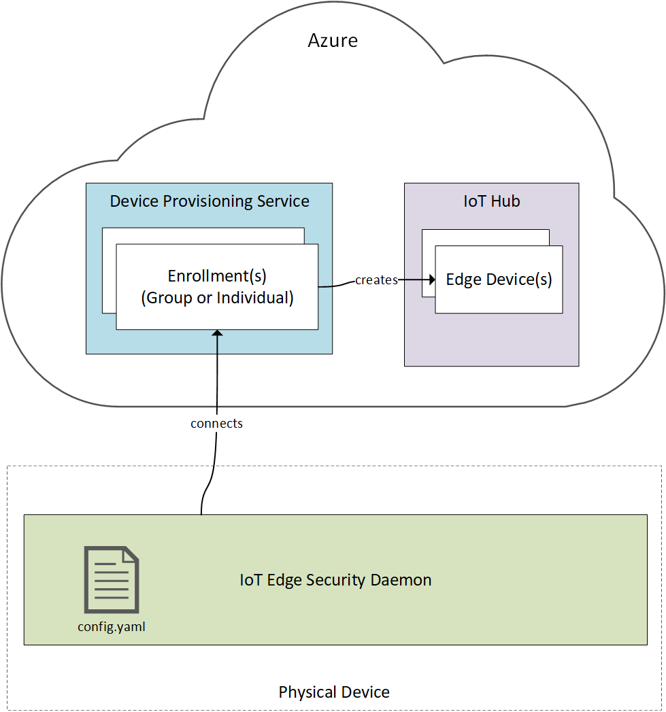
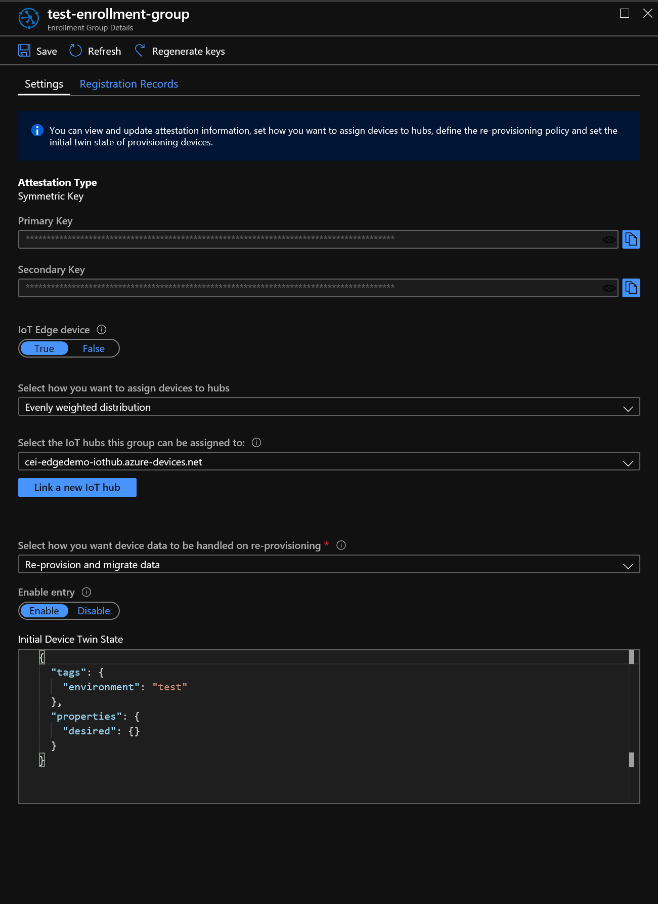

# Provisioning and Deployment at Scale
Until this point, we have been provisioning devices and deploying to those devices manually, requiring human intervention.  However, this will obviously not scale when working with hundreds or thousands of remote devices.  In this demo, we'll see how we can manage IoT devices and solutions at scale through automated provisioning and scaled deployments.

## Device Provisioning Service (DPS)
The Azure Device Provisioning Service links to your Azure IoT Hub(s), and enables just-in-time provisioning of devices to your hub(s) without requiring human intervention.  This process is known as *enrollment*, and requires device identity to be ascertained in one of the following ways:

1.  X509 Certificate
2.  Trusted Platform Module (TPM)
3.  Symmetric Key (Development Only)

### How It Works


1. The device manufacturer updates the etc/iotedge/config.yaml on the device with the appropriate provisioning configuration (in this case, we'll use X.509)

```yaml
# DPS X.509 provisioning configuration
provisioning:
  source: "dps"
  global_endpoint: "https://global.azure-devices-provisioning.net"
  scope_id: "<SCOPE_ID of the DPS enrollment>"
  attestation:
    method: "x509"
    registration_id: "<OPTIONAL REGISTRATION ID. LEAVE COMMENTED OUT TO REGISTER WITH CN OF identity_cert>"
    identity_cert: "<REQUIRED URI TO DEVICE IDENTITY LEAF CERTIFICATE>"
    identity_pk: "<REQUIRED URI TO DEVICE IDENTITY PRIVATE KEY>"
  dynamic_reprovisioning: false
```
1. IoT Edge Security Daemon attempts to provision the device against the DPS associated with the given *scope_id*
2. The device's leaf certificate is authenticated against a DPS enrollment's root certificate
3. If authentication succeeds, the appropriate DPS enrollment creates a logical device within the associated IoT Hub and the physical device is connected

### Enrollment Configuration
Let's take a look at a Symmetric Key DPS enrollment configuration to see how things work!



### Demo: Automated Provisioning
In this example, we'll provision a new device via *symmetric key* attestation.

1. ssh into the *test-auto-provision-1* (ssh azureuser@ipaddress)
2. Run command *cd /etc/iotedge*
3. Run command *sudo vim config.yaml
   1. Enter insert mode command *i*
   2. uncomment the symmetric key section, and set the following values:
      1. Scope_ID of the Device Provisioning Service
      2. Set registration id to *test-auto-provision-1*
      3. Set the symmetric key to the generated key against the Enrollment's primary key (you can create a symmetric key with the with the following bash script)
```
keybytes=$(echo $primaryKeyFromDpsEnrollment | base64 --decode | xxd -p -u -c 1000)
symmetricKey=$(echo -n $nameOfDevice | openssl sha256 -mac HMAC -macopt hexkey:$keybytes -binary | base64)
```
   3. Save and quit vim (*ESC*, *:x!*)
4. Run command *sudo systemctl restart iotedge*
5. Check the status with the following commands:
   1. *sudo systemctl status iotedge*
   2. *sudo iotedge list* (note nothing should be running)
   3. if you come across problems, view the logs with *journalctl --no-pager -u iotedge*

## Scaled Deployments
When looking at large fleets of devices, it's impractical to perform manual / in-person deployments. For these scenarios, we really need a secure means of performing Over the Air deployments and updates of our software.  Additionally, we may want to target a limited number of devices for phased deployments.

### Demo: Query Devices
1. Navigate to the IoT Hub, and select *Query Devices*
2. Add the following query

```json
tags.environment='test'
```

> NOTE, you can also query by desired and reported device and module properties.  For instance, the following query will return any devices whose module twin contains a temperature greater than 40 degrees


```sql
Select * from devices.modules where properties.reported.highTemperature>40
```

### Demo: Create Scaled Deployment (VS Code)

> NOTE, While the following demo will focus on deployments via VS Code, you can also automate these steps through the Azure CLI.

1. Open the VS Code Command Palette and select *Azure IoT Edge: Create Deployment at Scale*
2. Select the built Edge Deployment File (in the /config directory)
   1. Make sure to have selected the deployment.template.json file and select *Generate IoT Edge Deployment Manifest* first
3. Enter a unique name for the deployment
4. Enter the following for the *target condition*

```sql
tags.environment='test'
```
5. You can keep the priority at 10

### Create Scaled Deployment (Azure CLI)
You can also initiate scaled deployments through the Azure CLI and automated build / release pipelines:

#### Create an new deployment via Azure CLI:

```
az iot edge deployment create --deployment-id [deployment id] --hub-name [hub name] --content [file path] --labels "[labels]" --target-condition "[target query]" --priority [int]
```

#### Monitor deployments
The following command provides deployment target counts, applied count, reported successful counts, and reported failure counts
```
az iot edge deployment show --deployment-id [deployment id] --hub-name [hub name]
```
