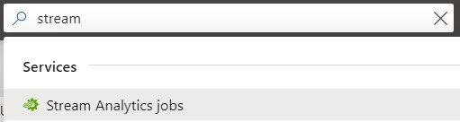

# LAB 5 - AZURE
In this lab, you'll be creating an Azure Stream Analytics job and an Azure Cosmos DB collection to capture and store sensor data. Once the data is in Cosmos you can write custom queries for analytics.

### Prerequisite (sort of...) - Lab 4
All of the devices that have completed Lab 4 are sending their data to a single IoT Hub Cloud Resource. With that being said, as long as someone has completed Lab 4, there will be data to store. So, if you haven't completed Lab 4 but you really want to play around in Azure, you can take advantage of other device data for this lab. If you completed the lab make sure to keep it connected to IoT Hub.

## TASK 1: Sign In to Azure
It's pronounced AH!-zure, not like the French meat dipping sauce (_au jus_) or the fancy replace-the-u-with-an-o sound (_ahzore_). :roll_eyes:

| Step |
|-|
|1. Choose your favorite browser and navigate to [The Azure Portal](https://portal.azure.com/)|
|2. If you're already SSO'd into a MS account then sign out and return to the portal|
|3. Sign in as/with your city and team # - [city]pidayuser[team#]@piday.dev|
|4. Ask one of the instructors for your password|

## TASK 2: Create a Stream Analytics Job Resource
Azure Stream Analytics (ASA) is a real-time analytics and monitoring service. You're going to create an ASA job to capture your IoT Hub data.

| Step |
|-|
|2. In the search box at the top of your screen type _stream_ and select **Stream Analytics jobs**:  |
|3. Choose **+ Add**|
|4. Type _pi-sensor-data-job_ in the **Job name** box|
|5. In the **Resource group list**, choose your pre-provisioned resource group (piday-_[yourCity]_-team-_[team#]_)|
|6. Change the **Location** to **(US) East US**|
|7. Click **Create** and wait for your deployment to finish.....|
|8. Once it's complete, click **Go to resource**|

 

## TASK 3: Create a Stream Analytics Job Input
Now that you've deployed your ASA job, you need to associate the IoT Hub instance as a data input.

| Step |
|-|
|1. From the **Overview** "blade" (fancy word for an Azure "window"), under the **Job topology** heading, choose **Inputs**|
|2. Click **+ Add stream input** and choose **IoT Hub** from the list|
|3. Name the **Input alias** _sensor-data-iot-hub-input_|
|4. Select **Provide IoT Hub settings manually**|
|5. In the **Iot Hub** box type _piday-hub_|
|6. In the **Shared access policy name** box type _piday_|
|7. In the **Shared access policy key** box paste _bH+LVqVWIIQNuT8ObJnfkJi6ocjNtkFR1/nONMGTOHE=_. **Note - YOU SHOULD NEVER PUT ACCESS KEYS IN A PUBLIC REPO!** |
|8. Have some fun with the _Consumer group_ value. It's not often that you get to use the modulo (mod) operator but, today, you're going to take advantage of the opportunity. Set your _Consumer group_ value to _[lowercaseCityName]_-group-_[team# mod 5]_. Example: Team 1 mod 5 = 1|
|9. Click **Save**|

## TASK 4: Create a Stream Analytics Job Output
You have an ASA job with IoT Hub data input so now you need to sink your data to an Azure Cosmos DB. One has already been created for you (since it can take several minutes).

| Step |
|-|
|1. Choose **Outputs** (a few options below inputs)|
|2. Click **+ Add** and select **Cosmos DB**|
|3. Name the **Output alias** _cosmosdb-output_|
|4. Choose **Use existing** under the **Database** heading and select _pi-day_|
|5. Enter _sensor-data_ in the **Container name** box|
|6. Click **Save**|

## TASK 5: Write a Steam Analytics Query
Alright, your job now has an input and an output. Finish up the ASA job by writing a query and streaming some data.

| Step |
|-|
|1. Open the **Query** blade (right above **Outputs**)|
|2. In the query editor window, change **[YourOutputAlias]** to _[cosmosdb-output]_ and **[YourInputAlias]** to _[sensor-data-iot-hub-input]_|
|3. Click **▶ Test Query** to capture the stream as sample data|
|4. Click **Save query**|
|5. Choose **Overview** from the top of the menu containing Inputs, Outputs, and Query|
|6. Click **▶ Start** and **Start** |

## TASK 6: View Data In Cosmos DB
Sensor data is currently being streamed to your (auto-magically provisioned) Cosmos DB. Take a look at your data that's now stored on someone else's compu...I mean, the cloud.....

| Step |
|-|
|1. In the search bar at the top of the page type _pidayuser_|
|2. Selecting the resource in the drop down will take you directly to it|
|3. Select the Data Explorer tab located in the blade on the left (You might need to click the double arrows >> to expand the blade)|
|4. In the frame that opened, you should see a drop down arrow next to the Database you created, expand the drop down to see the collections in the DB|
|5. Select the Collection you made in the earlier task and click on Items. This will show you the records in your collection|
