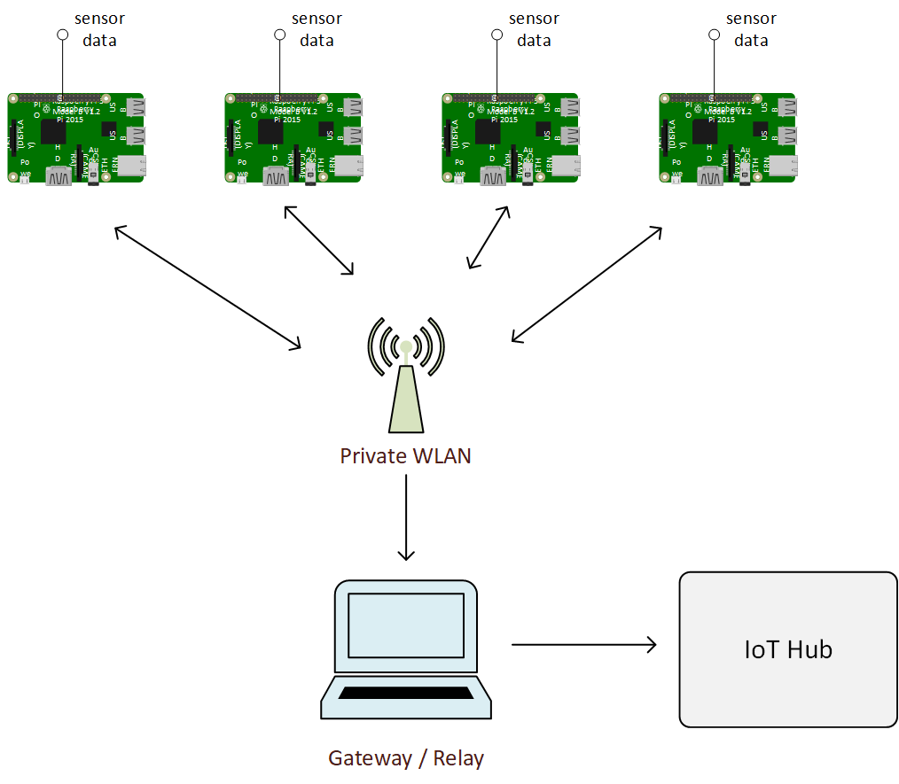
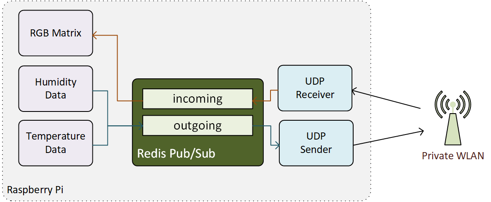
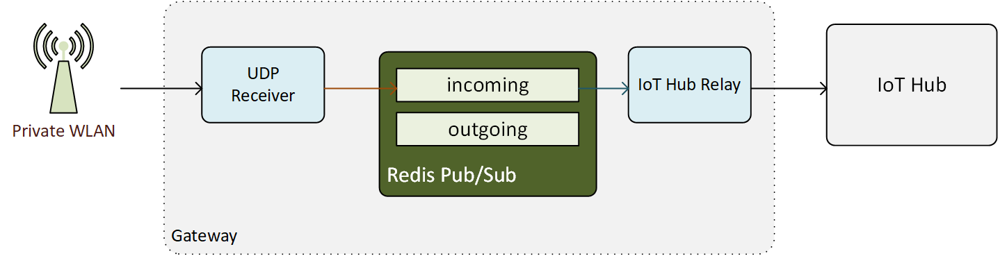

# MESSAGING
These .NET Core console apps handle relaying of messages to all the devices as well as up to IoT hub. Programs will interact with the message bus by publishing or subscribing to the Redis Pub/Sub service.  Those messages will be _broadcast_ to the rest of the devices using a UDP broadcast.



## Setup
The minimum requirement is to launch a Redis service in a docker conatiner mapping the container port to the host port.

### Raspbery PI / Linux / macOS
The quickest way to get the messaging setup is to use the Docker Compose file:

```docker-compose up```

This will launch three containers: Redis, Sender, Receiver.  

### Windows
The Sender and Receiver rely on UDP broadcasts to communicate with all devices on the "mesh."  However, Docker on Windows will not allow "host" networking and the docker-compose method above will not work. You will need to run the .NET Console apps interactively.

1. Launch Redis in a container
    * ```docker run -d -p:6379:6379 redis```
2. Start the listener (in the listener folder)
    * ```start dotnet run```
2. Start the sender (in the sender folder)
    * ```start dotnet run```

*NOTE*: Windows Firewall likes to learn to block the sender and listener console apps. If they mysteriously stop working, check to see if they are blocked.

## Exchanging Messages
Messages are sent / received through Redis pub/sub but then relayed across the network using a UDP network broadcast.



### Sending Messages
To send messages to all the (listening) devices, simply post a message to the **"outgoing"** channel on the Redis pub/sub bus.

```
using System;
using StackExchange.Redis;

ConnectionMultiplexer redis = ConnectionMultiplexer.Connect("localhost");
var message = "{city: 'London', room: 'living-room', sensor:'temperature', value: 75.3}";
redis.GetSubscriber().Publish("outgoing", message);            
```

### Receiving Messages
Messages which were broadcast on the network are routed to the **"incoming"** Redis pub/sub channel.  Receiving messages is just as straightforward:
```
using System;
using StackExchange.Redis;

ConnectionMultiplexer redis = ConnectionMultiplexer.Connect("localhost");

redis
    .GetSubscriber()
    .Subscribe("incoming")
    .OnMessage(message => DoSomethingImportant(message.Message));
```

## Relaying to IoT Hub
While the peer-to-peer messaging uses local network broadcasting, the messages still need to be relayed to an Azure IoT Hub.  The _relay_ folder contains a .NET Core Console app which receives messages from the Redis "incoming" channel and sends them to an IoT Hub.



### Setup
To relay messages to an IoT Hub, the device must be on the network comprising the Raspberry Pi's as well as an Internet-accesible network.

1. Create an IoT Hub in Azure (assumed previously done)
2. Add a device to the IoT Hub and obtain the connection string
3. Update the IOT_HUB_DEVICE_CONNECTION_STRING constant in relay/Program.cs with this connection string
4. Run the console app in the background
    * ```start dotnet run```

The console app will now begin relaying broadcasted messages to the cloud.

## Additional Details

### Projects / Files
- listener - Receives UDP broadcasts, publishes to the incoming Redis channel
- sender - Subscribes to the outgoing Redis channel, transmits via UDP broadcast
- relay - Subscribes to the incoming channel, transmits to the IoT Hub
- sample-data - Publishes sample data to the Redis incoming channel
- docker-compose.yml - Starts the listener, sender and redis containers
